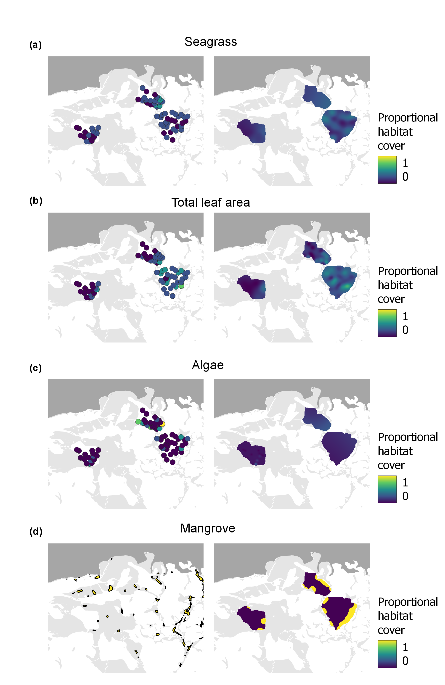

[](https://zenodo.org/doi/10.5281/zenodo.10802559)

This script outlines the analysis and code used in James et al. 2024 to
analyze the effect of habitat loss on ecosystem-scale trophic function.
Percent cover data (FHAP_pc.csv) from the Florida Fish and Wildlife
Conservation Commission Fisheries Habitat Assessment Program were used
to generate habitat maps and combined with basal resource use from
stable isotope mixing models (mm3spp.csv) from [James et
al. 2022](https://doi.org/10.1093/icesjms/fsac112) to generate
*E*-scapes for bay anchovy, pinfish, and pink shrimp from 2007-2019.
This can also be found as an [R script](sgE-scape_analysis.R).

## Generate habitat maps from monitoring data

Benthic habitat maps were generated based on spatial interpolation of
benthic cover data from the Florida Fish and Wildlife Commission Fish
Habitat Assessment Program. We used ordinary kriging with the `gstat`
package to create a habitat map for seagrass, algae, and total leaf area
for each basin in each year from 2007 to 2019 (with the exception of
2013 due to not having data on leaf area) at a 10 x 10 m cell size. For
each habitat map, the variogram was automatically fit with the
`autofitVariogram()` function in the `automap` package. To create a
habitat map for mangrove, a 500 m width buffer was placed around the
mangrove islands that bordered each basin. A 10 x 10 m raster was
created for each basin, and cells were assigned as mangrove (value of 1)
if they fell within the 500 m buffer and given a value of 0 if outside
of the buffer.

``` r

# load libraries 
library(tidyverse)
library(sf)
library(stars)
library(gstat)
library(automap)

# load shape files for each basin and make empty grid
# Rankin shape file
ran = st_read('gis/Rankin.shp') %>% st_transform(32617)

# make empty stars raster with 10 m cell size
ran_grid = st_bbox(ran) %>%
  st_as_stars(dx = 10) %>%
  st_set_crs(32617) %>%
  st_crop(ran)

# Johnson shape file
jon = st_read('gis/Johnson.shp') %>% st_transform(32617)

# make empty stars raster with 10 m cell size
jon_grid = st_bbox(jon) %>%
  st_as_stars(dx = 10) %>%
  st_set_crs(32617) %>%
  st_crop(jon)

# Whipray shape file
whp = st_read('gis/Whipray.shp') %>% st_transform(32617)

# make empty stars raster with 10 m cell size
whp_grid = st_bbox(whp) %>%
  st_as_stars(dx = 10) %>%
  st_set_crs(32617) %>%
  st_crop(whp)

# Create mangrove habitat map for each basin 
man = st_read('gis/FlBayMan500mBuf.shp')

# Rankin 
man_ran =  man |> st_intersection(ran) |> 
  st_rasterize(ran_grid) %>% 
  mutate(Acres = if_else(Acres > 0, 1, 0))
# Johnson
man_jon =  man |> st_intersection(jon) |>
  st_rasterize(jon_grid) %>% 
  mutate(Acres = if_else(Acres > 0, 1, 0))

# Whipray
man_whp =  man |> st_intersection(whp) |>
  st_rasterize(whp_grid) %>% 
  mutate(Acres = if_else(Acres > 0, 1, 0))

# combine into tibble
df_man = tibble(BASIN = c('RAN', 'JON', 'WHP'),
                man_r = c(list(man_ran), list(man_jon), list(man_whp)))

# Seagrass, algae, and total leaf area
df = st_read("FHAP_pc.csv",
             options=c("X_POSSIBLE_NAMES=LON","Y_POSSIBLE_NAMES=LAT")) |> 
  st_set_crs(4326) %>% st_transform(32617) |> 
  group_by(BASIN, YEAR) |> 
  nest() |> 
  mutate(sg = map(data, \(data) 
                  autofitVariogram(data$SG ~ 1, as(data, "Spatial"))),
         alg = map(data, \(data) 
                   autofitVariogram(data$ALG ~ 1, as(data, "Spatial"))),
         lab = map(data, \(data) 
                   autofitVariogram(data$LAB ~ 1, as(data, "Spatial"))),
         sg_r = case_when(
           BASIN == 'RAN' ~ map2(data,sg, \(data,sg)
                                 krige(SG~1, locations = data,
                                       newdata = ran_grid, model = sg$var_model)),
           BASIN == 'JON' ~ map2(data,sg, \(data,sg)
                                 krige(SG~1, locations = data,
                                       newdata = jon_grid, model = sg$var_model)),
           BASIN == 'WHP' ~ map2(data,sg, \(data,sg)
                                 krige(SG~1, locations = data,
                                       newdata = whp_grid, model = sg$var_model))),
         alg_r = case_when(
           BASIN == 'RAN' ~ map2(data,alg, \(data,alg)
                                 krige(ALG~1, locations = data,
                                       newdata = ran_grid, model = alg$var_model)),
           BASIN == 'JON' ~ map2(data,alg, \(data,alg)
                                 krige(ALG~1, locations = data,
                                       newdata = jon_grid, model = alg$var_model)),
           BASIN == 'WHP' ~ map2(data,alg, \(data,alg)
                                 krige(ALG~1, locations = data,
                                       newdata = whp_grid, model = alg$var_model))),
         lab_r = case_when(
           BASIN == 'RAN' ~ map2(data,lab, \(data,lab)
                                 krige(LAB~1, locations = data,
                                       newdata = ran_grid, model = lab$var_model)),
           BASIN == 'JON' ~ map2(data,lab, \(data,lab)
                                 krige(LAB~1, locations = data,
                                       newdata = jon_grid, model = lab$var_model)),
           BASIN == 'WHP' ~ map2(data,lab, \(data,lab)
                                 krige(LAB~1, locations = data,
                                       newdata = whp_grid, model = lab$var_model))))

# create dataset of rasters for each year
df_r = df |>
  select(YEAR, BASIN, sg_r, alg_r, lab_r) |> 
  left_join(df_man, by = 'BASIN')
```

 **Figure S1.** Example kriged habitat maps (right
column) from monitoring points (left column) for a) seagrass, b) total
leaf area, c) algae, and d) mangrove. Left column map for d) mangrove is
the habitat map used to generate the 500 m buffer. Habitat maps shown
here were generated from 2019 data.

## Calculate Index of Energetic Importance (IEI) values

Combining the basal resource use and habitat maps, we calculated an
index of energetic importance (IEI) for each of the four
resource/habitat type combinations for each consumer (James et
al. 2022a). Each IEI was calculated with the following formula:
$$IEI_i=  \frac{f_{source_i}}{f_{habitat_i}} $$ where $f_{source_i}$ is
the fraction of the contribution of source $i$ to the total source use
of the consumer based on the results of the mixing model and
$f_{habitat_i}$ is the fraction of habitat type $i$ that produces source
$i$ to the overall area at a scale relevant to the movement range of the
consumer (i.e., area of the circle around the sampling point). An
example of resource/habitat type combination is amount of
seagrass-derived production and the cover area of seagrass habitat. An
IEI around one means that the consumer is using a resource
$f_{source_i}$ around the same amount as the proportion of that
resource’s habitat type $f_{habitat_i}$ relative to total area that the
consumer forages. An IEI \> 1 means that the consumer is using that
source more than expected based on the proportion of that habitat type
in the total foraging area, while the opposite is true for an IEI \< 1.
We calculated IEIs for each of the 3 consumer species by randomly
generating 50 points within the kriged habitat maps for Johnson, Rankin,
and Whipray basins (n = 150 for each species). The $f_{habitat_i}$ was
calculated by taking the mean proportion cover of the habitat map within
a 300 m radius buffer of the point with the `exactextractr` package.
Some of the kriging models led to values for habitat cover that were \<
0, and if this was the case, $f_{habitat_i}$ values \< 0 were converted
to 0 before calculating IEI values. IEI values were calculated using the
habitat maps from 2019 to closely match when the sampling for basal
resource use was conducted.

``` r
# load mixing model data
iso = read_csv('mm3spp.csv')

# random points within each basin
# set sample number 
n = 50

# set radius length
radius = 300

# filter raster to only 2019 to use for IEI values 
r19 = df_r |> 
  filter(YEAR == 2019)

# create buffer around random points for each basin
buf_ran = st_sample(ran, n) %>%
  st_as_sf %>%
  st_transform(32617)%>% # utm 17
  mutate(site = row_number(),
         BASIN = 'RAN')%>%
  st_buffer(dist = radius)

buf_jon = st_sample(jon, n) %>%
  st_as_sf %>%
  st_transform(32617)%>% # utm 17
  mutate(site = row_number(),
         BASIN = 'JON')%>%
  st_buffer( dist = radius)

buf_whp = st_sample(whp, n) %>%
  st_as_sf %>%
  st_transform(32617)%>% # utm 17
  mutate(site = row_number(),
         BASIN = 'WHP')%>%
  st_buffer( dist = radius)

# calculate f_habitat for each buffer 
ran_fhab = tibble(site = buf_ran$site,
                  BASIN = 'RAN') |> 
  mutate(f_sg = exact_extract(terra::rast(r19[r19$BASIN == 'RAN',]$sg_r[[1]]), buf_ran, 'mean', progress = F)[[1]],
         f_man = exact_extract(terra::rast(r19[r19$BASIN == 'RAN',]$man_r[[1]]), buf_ran, 'mean', progress = F)[[1]],
         f_epi = exact_extract(terra::rast(r19[r19$BASIN == 'RAN',]$lab_r[[1]]), buf_ran, 'mean', progress = F)[[1]],
         f_alg = exact_extract(terra::rast(r19[r19$BASIN == 'RAN',]$alg_r[[1]]), buf_ran, 'mean', progress = F)[[1]])


jon_fhab = tibble(site = buf_jon$site,
                  BASIN = 'JON') |> 
  mutate(f_sg = exact_extract(terra::rast(r19[r19$BASIN == 'JON',]$sg_r[[1]]), buf_jon, 'mean', progress = F)[[1]],
         f_man = exact_extract(terra::rast(r19[r19$BASIN == 'JON',]$man_r[[1]]), buf_jon, 'mean', progress = F)[[1]],
         f_epi = exact_extract(terra::rast(r19[r19$BASIN == 'JON',]$lab_r[[1]]), buf_jon, 'mean', progress = F)[[1]],
         f_alg = exact_extract(terra::rast(r19[r19$BASIN == 'JON',]$alg_r[[1]]), buf_jon, 'mean', progress = F)[[1]])


whp_fhab = tibble(site = buf_whp$site,
                  BASIN = 'WHP') |> 
  mutate(f_sg = exact_extract(terra::rast(r19[r19$BASIN == 'WHP',]$sg_r[[1]]), buf_whp, 'mean', progress = F)[[1]],
         f_man = exact_extract(terra::rast(r19[r19$BASIN == 'WHP',]$man_r[[1]]), buf_whp, 'mean', progress = F)[[1]],
         f_epi = exact_extract(terra::rast(r19[r19$BASIN == 'WHP',]$lab_r[[1]]), buf_whp, 'mean', progress = F)[[1]],
         f_alg = exact_extract(terra::rast(r19[r19$BASIN == 'WHP',]$alg_r[[1]]), buf_whp, 'mean', progress = F)[[1]])

# join together 
fhab = bind_rows(ran_fhab, jon_fhab, whp_fhab) |> 
  mutate(across(f_sg:f_alg, ~if_else(.x < 0, 0, .x)))

# calculate IEI for each species
IEI = fhab |> 
  slice(rep(1:n(), each = length(unique(iso$Species)))) |> 
  mutate(Species = rep(unique(iso$Species), times = nrow(fhab))) |> 
  left_join(iso, by = 'Species') |> 
  mutate(iei_sg = Seagrass/f_sg,
         iei_man = Mangrove/f_man,
         iei_epi = Epiphytes/f_epi,
         iei_alg = Algae/f_alg,
         iei_man = ifelse(iei_man == Inf, NA, iei_man)) |> 
  group_by(Species) |> 
  summarize(across(iei_sg:iei_alg, \(x) median(x, na.rm = T)))
```

 **Figure 2.** Boxplot of the index of energetic
(IEI) values for each resource/habitat based on the 50 random points in
each basin for each species calculated using the habitat maps for 2019.
The horizontal black line represents IEI value of 1. IEI values \> 1
means that the consumer is using that source more than expected based on
the proportion of that habitat in the total foraging area, while the
opposite is true for an IEI \< 1.

## Make *E*-scape for each species, year, and basin

*E*-scapes were generated for each species at each basin between 2007
and 2019. IEI values were combined with habitat cover areas within a
landscape foraging unit (grid cell with an area that corresponds to the
movement range of the consumer) to calculate the habitat resource index
(HRI). HRI was calculated with the following formula:
$$HRI_x= \sum_{i=1}^{n}{\tilde{IEI_i}*f_{habitat_i}}$$ where
$\tilde{IEI_i}$ is the median of the IEI for the species-specific
source/habitat combination $i$ and $f_{habitat_i}$ is the fraction of
habitat $i$ to the overall area within landscape foraging unit $x$. HRI
is an index that represents a relative measurement of the quality of the
habitats for producing the resources used by the consumer based on
stable isotope analysis. An HRI value of 1 means that the area is
producing the average amount of resources for the consumer. HRI values
\> 1 mean that the area is better for producing resources (i.e., more
energetic resources) being used by the consumer, while HRI values \< 1
shows that the habitats most important to the production of resources
being used by the consumer are underrepresented within the landscape
foraging unit. The $f_{habitat_i}$ was calculated by taking the mean
value of the habitat map within each landscape foraging unit with the
`exactextractr` package. Some of the kriging models led to values for
habitat cover that were \< 0, and if this was the case, $f_{habitat_i}$
values \< 0 were converted to 0 before calculating HRI values. Each
basin was subdivided into a grid of 600 m x 600 m landscape foraging
units to generate an E-scape. This size was chosen to correspond to the
300 m radius (600 m diameter) buffer that was used to calculate the
IEIs. Given the singular temporal point of resource use data, IEI values
calculated for 2019 were applied across the entire time series.

``` r
library(exactextractr)
# set radius length for size of landscape foraging units
radius = 300

# make a grid of landscape foraging units
ran_grd = st_make_grid(ran, cellsize = radius*2) %>% 
  st_sf(geometry = .) %>%
  filter(lengths(st_intersects(., ran)) > 0) |> 
  mutate(BASIN = 'RAN')

jon_grd = st_make_grid(jon, cellsize = radius*2) %>% 
  st_sf(geometry = .) %>%
  filter(lengths(st_intersects(., jon)) > 0) |> 
  mutate(BASIN = 'JON')

whp_grd = st_make_grid(whp, cellsize = radius*2) %>% 
  st_sf(geometry = .) %>%
  filter(lengths(st_intersects(., whp)) > 0) |> 
  mutate(BASIN = 'WHP')

grd = bind_rows(ran_grd, jon_grd, whp_grd) |> 
  group_by(BASIN) |> 
  nest(grid = geometry)

# calculate the f_hab for each basin and year
f_hab = df_r |> 
  left_join(grd, by = 'BASIN') |> 
  mutate(f_sg = map2(sg_r, grid, \(r, grid) 
                     exact_extract(terra::rast(r), grid, 'mean', progress = F)[[1]]),
         f_epi = map2(lab_r, grid, \(r, grid) 
                     exact_extract(terra::rast(r), grid, 'mean', progress = F)[[1]]),
         f_man = map2(man_r, grid, \(r, grid) 
                     exact_extract(terra::rast(r), grid, 'mean', progress = F)[[1]]),
         f_alg = map2(alg_r, grid, \(r, grid) 
                     exact_extract(terra::rast(r), grid, 'mean', progress = F)[[1]])) |> 
  dplyr::select(YEAR, BASIN, grid, f_sg:f_alg) |> 
  unnest(grid:f_alg) |> 
  ungroup()|> 
  mutate(across(f_sg:f_alg, ~if_else(.x < 0, 0, .x)))

# calculate HRI for all forgaing units for each species
HRI = f_hab |>  
  slice(rep(1:n(), each = length(unique(IEI$Species)))) |> 
  mutate(Species = rep(unique(IEI$Species), times = nrow(f_hab))) |> 
  left_join(IEI, by = 'Species') |> 
  mutate(HRI = f_sg*iei_sg + f_man*iei_man + 
           f_epi*iei_epi + f_alg*iei_alg) |> 
  st_as_sf()

# save output of all E-scapes 
st_write(HRI, 'gis/FLBay_E-scapeAll.shp')
```

 **Figure 4** *E*-scapes for a) bay anchovy, b)
pinfish, and c) pink shrimp before and after the 2015 seagrass die-off
for Johnson, Rankin, and Whipray basins in Florida Bay. HRI values from
all years before and after were averaged for each landscape foraging
unit. Warm colors (reds) represent habitat resource index (HRI) values
\> 1 and cool colors (blues) represent HRI values \< 1. HRI values \> 1
indicate greater production of resources (i.e., more energetic
resources) being used by the consumer, while the opposite is true for
HRI values \< 1.

## Statistical analyses

### ANOVA

We conducted an analysis of variance (ANOVA) to compare the differences
in HRI values across species, basin, and before and after the die-off.
We created categorical term for if the HRI value was from before or
after the seagrass die-off for the ANOVA. The years before 2015 were
assigned as pre-die-off, and the years after 2015 were designated as
post-die-off for our model. Species, basin, the categorical term for
before or after the die-off and all interactions were used as predictor
terms in the ANOVA. For significant terms in our model, pairwise
comparisons using model contrasts with a Bonferroni correction were
analyzed to test for significance among factor groups using the
`emmeans` package.

``` r
library(tidyverse)
library(sf)
library(ggeffects)
library(emmeans)
library(multcomp)
library(multcompView)
```

``` r
df = st_read('gis/FLBay_E-scapeAll.shp') |> 
  drop_na(HRI) |> 
  mutate(do = case_when(
    YEAR <= 2015 ~ 'Pre Die-off',
    YEAR > 2015 ~ 'Post Die-off'),
    do = factor(do, levels = c('Pre Die-off','Post Die-off'))) |> 
 as_tibble()
## Reading layer `FLBay_E-scapeAll' from data source 
##   `C:\Users\wrjam\Dropbox\WorkDocs\R\Github\ManuscriptData\James_etal_sgE-scape_GCB\gis\FLBay_E-scapeAll.shp' 
##   using driver `ESRI Shapefile'
## Simple feature collection with 8892 features and 8 fields
## Geometry type: POLYGON
## Dimension:     XY
## Bounding box:  xmin: 504504.6 ymin: 2768518 xmax: 528093.8 ymax: 2781352
## Projected CRS: WGS 84 / UTM zone 17N


m = aov(HRI ~ do*BASIN*Species, data = df)

summary(m)
##                    Df Sum Sq Mean Sq F value Pr(>F)    
## do                  1  262.6  262.62 2021.90 <2e-16 ***
## BASIN               2  362.5  181.24 1395.40 <2e-16 ***
## Species             2  151.3   75.65  582.47 <2e-16 ***
## do:BASIN            2  392.7  196.36 1511.76 <2e-16 ***
## do:Species          2   28.6   14.32  110.23 <2e-16 ***
## BASIN:Species       4    0.8    0.19    1.50  0.199    
## do:BASIN:Species    4   43.0   10.76   82.83 <2e-16 ***
## Residuals        8838 1147.9    0.13                   
## ---
## Signif. codes:  0 '***' 0.001 '**' 0.01 '*' 0.05 '.' 0.1 ' ' 1

# check region comparisons
model_means = emmeans(object = m,
                      ~ do*BASIN*Species)

# add letters to each mean
model_means_cld = cld(object = model_means,
                      adjust = "bonf",
                      Letters = letters,
                      sort = F,
                      alpha = 0.05) |> 
  mutate(code = str_replace_all(.group, ' ', ''))

# show output
model_means_cld
##              do BASIN     Species    emmean         SE   df  lower.CL  upper.CL
## 1   Pre Die-off   JON Bay anchovy 1.7508912 0.01533955 8838 1.7049928 1.7967895
## 2  Post Die-off   JON Bay anchovy 0.9323363 0.02169340 8838 0.8674262 0.9972464
## 3   Pre Die-off   RAN Bay anchovy 1.4438843 0.01580449 8838 1.3965947 1.4911738
## 4  Post Die-off   RAN Bay anchovy 0.7418408 0.02235092 8838 0.6749633 0.8087183
## 5   Pre Die-off   WHP Bay anchovy 0.9356377 0.01204004 8838 0.8996120 0.9716635
## 6  Post Die-off   WHP Bay anchovy 1.0469954 0.01702719 8838 0.9960474 1.0979435
## 7   Pre Die-off   JON     Pinfish 1.9971194 0.01533955 8838 1.9512210 2.0430177
## 8  Post Die-off   JON     Pinfish 1.1051307 0.02169340 8838 1.0402206 1.1700408
## 9   Pre Die-off   RAN     Pinfish 1.8924049 0.01580449 8838 1.8451154 1.9396944
## 10 Post Die-off   RAN     Pinfish 0.6825102 0.02235092 8838 0.6156327 0.7493877
## 11  Pre Die-off   WHP     Pinfish 1.1979540 0.01204004 8838 1.1619283 1.2339797
## 12 Post Die-off   WHP     Pinfish 1.3218147 0.01702719 8838 1.2708666 1.3727627
## 13  Pre Die-off   JON Pink shrimp 1.6473419 0.01533955 8838 1.6014435 1.6932403
## 14 Post Die-off   JON Pink shrimp 0.9657486 0.02169340 8838 0.9008385 1.0306586
## 15  Pre Die-off   RAN Pink shrimp 1.2975270 0.01580449 8838 1.2502374 1.3448165
## 16 Post Die-off   RAN Pink shrimp 0.9659071 0.02235092 8838 0.8990296 1.0327846
## 17  Pre Die-off   WHP Pink shrimp 0.8973340 0.01204004 8838 0.8613083 0.9333598
## 18 Post Die-off   WHP Pink shrimp 1.0308429 0.01702719 8838 0.9798948 1.0817909
##           .group code
## 1   a               a
## 2    bc            bc
## 3      d            d
## 4       e           e
## 5    b              b
## 6        fg        fg
## 7          h        h
## 8        f          f
## 9           i       i
## 10      e           e
## 11           j      j
## 12            k     k
## 13             l    l
## 14   bc   g       bcg
## 15            k     k
## 16   bc   g       bcg
## 17   b              b
## 18    c  fg       cfg

df = left_join(df, model_means_cld, by = c('Species', 'BASIN', 'do'))
```

 **Figure 4.** Boxplot for HRI values for each
species and basin pre and post 2015 seagrass die-off. Different letters
indicate significantly different (p \< 0.05) groups based on model
contrast comparisons with a Bonferroni correction.

### Breakpoint

Spatiotemporal trends in trophic function for each species were
determined by averaging the HRI values of each landscape foraging unit
to generate a basin-wide mean for each basin and year. We conducted
breakpoint analysis across years on the mean trends on HRI value for
each species using the R package `strucchange`. This package uses simple
linear regression to estimate data breakpoints and test for differences
in mean conditions using an intercept-only model. We assessed the
optimal number of breakpoints for each model based on the lowest
Bayesian information criterion (BIC) score.

``` r
library(strucchange)
## Loading required package: zoo
## 
## Attaching package: 'zoo'
## The following objects are masked from 'package:base':
## 
##     as.Date, as.Date.numeric
## Loading required package: sandwich
## 
## Attaching package: 'strucchange'
## The following object is masked from 'package:stringr':
## 
##     boundary

df = st_read('gis/FLBay_E-scapeAll.shp') |>
  as_tibble() |>
  group_by(Species, BASIN, YEAR) |>
  summarize(hri = mean(HRI, na.rm = T), 
            .groups = 'drop') |> 
  arrange(YEAR) |> 
  group_by(Species, BASIN) |> 
  nest() |> 
  mutate(bp = map(data, \(data) breakpoints(hri~1, data = data, h = 3)),
         fstat = map(data, \(data) sctest(Fstats(hri~1, data = data))),
         f = map_dbl(fstat, 'statistic'),
         p = map_dbl(fstat, 'p.value'),
         ci = map2(data, bp, \(data, bp) {
           if(!is.na(bp$breakpoints)) {
             confint(bp, data = data)[1]$confint
           } else {
             NA
           }})) |> 
  unnest_wider(ci, simplify = T, names_sep = '_') |> 
  mutate(change = map_dbl(data, \(data) data$YEAR[ci_1[,2]]),
         lci = map_dbl(data, \(data) data$YEAR[ci_1[,1]]),
         uci = map_dbl(data, \(data) data$YEAR[ci_1[,3]])) |> 
  dplyr::select(Species, BASIN, f, p, change, lci, uci)
## Reading layer `FLBay_E-scapeAll' from data source 
##   `C:\Users\wrjam\Dropbox\WorkDocs\R\Github\ManuscriptData\James_etal_sgE-scape_GCB\gis\FLBay_E-scapeAll.shp' 
##   using driver `ESRI Shapefile'
## Simple feature collection with 8892 features and 8 fields
## Geometry type: POLYGON
## Dimension:     XY
## Bounding box:  xmin: 504504.6 ymin: 2768518 xmax: 528093.8 ymax: 2781352
## Projected CRS: WGS 84 / UTM zone 17N
## Warning: There were 18 warnings in `mutate()`.
## The first warning was:
## ℹ In argument: `fstat = map(data, function(data) sctest(Fstats(hri ~ 1, data =
##   data)))`.
## ℹ In group 1: `Species = "Bay anchovy"`, `BASIN = "JON"`.
## Caused by warning in `Fstats()`:
## ! 'from' changed (was too small)
## ℹ Run `dplyr::last_dplyr_warnings()` to see the 17 remaining warnings.

df
## # A tibble: 9 × 7
## # Groups:   Species, BASIN [9]
##   Species     BASIN     f        p change   lci   uci
##   <chr>       <chr> <dbl>    <dbl>  <dbl> <dbl> <dbl>
## 1 Bay anchovy JON   32.9  3.98e- 7   2015  2012  2016
## 2 Bay anchovy RAN   34.7  1.68e- 7   2015  2012  2016
## 3 Bay anchovy WHP    2.76 5.85e- 1     NA    NA    NA
## 4 Pinfish     JON   21.5  1.04e- 4   2016  2014  2017
## 5 Pinfish     RAN   73.6  7.40e-16   2015  2014  2016
## 6 Pinfish     WHP    2.16 7.27e- 1     NA    NA    NA
## 7 Pink shrimp JON   26.2  1.05e- 5   2015  2012  2016
## 8 Pink shrimp RAN    7.23 8.83e- 2   2015  2007  2017
## 9 Pink shrimp WHP    4.23 3.25e- 1     NA    NA    NA
```

 **Figure 5.** Breakpoints based on intercept model
for mean habitat resource index (HRI) values for a) bay anchovy, b)
pinfish, and c) pigfish for each basin. Vertical black line indicates
break point and grey shade represents the 95% confidence interval.
Horizontal line indicates model prediction and gray points indicate mean
± SD HRI values for basin.

### Correlations

We ran correlations between HRI values and $f_{habitat_i}$ across all
species, years, and basins.

``` r
df = st_read('gis/FLBay_E-scapeAll.shp') |>
  as_tibble() 
## Reading layer `FLBay_E-scapeAll' from data source 
##   `C:\Users\wrjam\Dropbox\WorkDocs\R\Github\ManuscriptData\James_etal_sgE-scape_GCB\gis\FLBay_E-scapeAll.shp' 
##   using driver `ESRI Shapefile'
## Simple feature collection with 8892 features and 8 fields
## Geometry type: POLYGON
## Dimension:     XY
## Bounding box:  xmin: 504504.6 ymin: 2768518 xmax: 528093.8 ymax: 2781352
## Projected CRS: WGS 84 / UTM zone 17N

# algae 
cor.test(x = df$f_alg, y = df$HRI, method = 'pearson')
## 
##  Pearson's product-moment correlation
## 
## data:  df$f_alg and df$HRI
## t = -9.9351, df = 8854, p-value < 2.2e-16
## alternative hypothesis: true correlation is not equal to 0
## 95 percent confidence interval:
##  -0.12555444 -0.08435823
## sample estimates:
##        cor 
## -0.1050014

# epipyhtes
cor.test(x = df$f_epi, y = df$HRI)
## 
##  Pearson's product-moment correlation
## 
## data:  df$f_epi and df$HRI
## t = 130.11, df = 8854, p-value < 2.2e-16
## alternative hypothesis: true correlation is not equal to 0
## 95 percent confidence interval:
##  0.8030317 0.8173403
## sample estimates:
##       cor 
## 0.8103068

#mangrove
cor.test(x = df$f_man, y = df$HRI)
## 
##  Pearson's product-moment correlation
## 
## data:  df$f_man and df$HRI
## t = 18.587, df = 8854, p-value < 2.2e-16
## alternative hypothesis: true correlation is not equal to 0
## 95 percent confidence interval:
##  0.1736649 0.2137565
## sample estimates:
##       cor 
## 0.1937916

#seagrass
cor.test(x = df$f_sg, y = df$HRI,  method = 'pearson')
## 
##  Pearson's product-moment correlation
## 
## data:  df$f_sg and df$HRI
## t = 107.72, df = 8854, p-value < 2.2e-16
## alternative hypothesis: true correlation is not equal to 0
## 95 percent confidence interval:
##  0.7439860 0.7620178
## sample estimates:
##       cor 
## 0.7531434
```

 **Figure 6.** Correlation for the proportional
habitat cover and habitat resource index (HRI) values for each landscape
foraging unit across all species and seasons. There was a positive
correlation between seagrass (r = 0.75, t = 105.9, p value \< 0.001) and
leaf area (r = 0.80, t = 125.2, p value \< 0.001) habitat cover with HRI
values. There was a slightly positive correlation between mangrove
habitat cover and HRI values (r = 0.23, t = 22.0, p value \< 0.001).
Algal habitat cover and HRI values had a slightly negative correlation
(r = -0.10, t = -9.5, p value \< 0.001).
